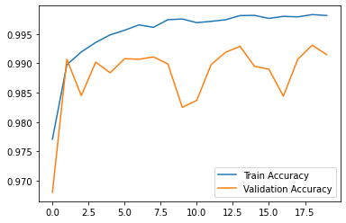
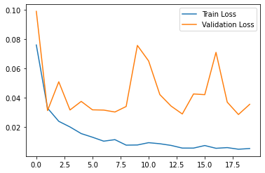

# MNIST-Digit-Recognition-with-CNN-Keras
 In this project, we build deep learning model in order to recognize the hand-written digits. We use Keras library and these steps have been done
 1. Data pre-process
 2. Create CNN Model and Training
 3. Evaluate the model success
 4. Predict new images with trained model
 
<div align="center">
  
  
</div>

## Introduction

* [Keras](https://keras.io/getting_started/) : Keras is an open-source software library that provides a Python interface for artificial neural networks. Keras uses TensorFlow or Theano libraries as backend. Keras is a powerful and easy-to-use free open source library for developing and evaluating deep learning models. We utilizi lots of built-in functions

* [DIGIT RECOGNITION MNIST in CSV](https://www.kaggle.com/oddrationale/mnist-in-csv) : The MNIST database (Modified National Institute of Standards and Technology database) is a large database of handwritten digits that is commonly used for training various image processing systems. In our example, we use this dataset and download with this kaggle adress.

## Requirements & Dependencies
* We build our algorithm using "Anaconda Environment" on Jupyter Notebook.
* Required packages and libraries are given as txt file (bio-enc.txt). You can directly create environment and activate like this:
  
  ```bash
  conda env create --file bio-env.txt
  conda activate env
  ```
 * If you want to install libraries manually, then fundamental packages as follows
 -----------------------------
| Library     |  Version      |
|-------------|-------------  |
|   Tensorflow    |   1.14.0           |
|   Keras         |   2.3.1          |
|   Pandas        |   1.1.3          |
|   Numpy         |   1.19.1            |
|   Matplotlib    |   3.3.1          |
-----------------------------

## Usage
* Download this repo and run "mnist-digit-recognition.ipynb" file jupyter notebook.
* Download dataset from above link and exract csv files (test and train) to the same file where your code is

## Experiment Results
result of the experiments as shown below. Notice that, there are hyper-parameters (epoch and batch size, optimizer, loss function etc) that should be considered

 

